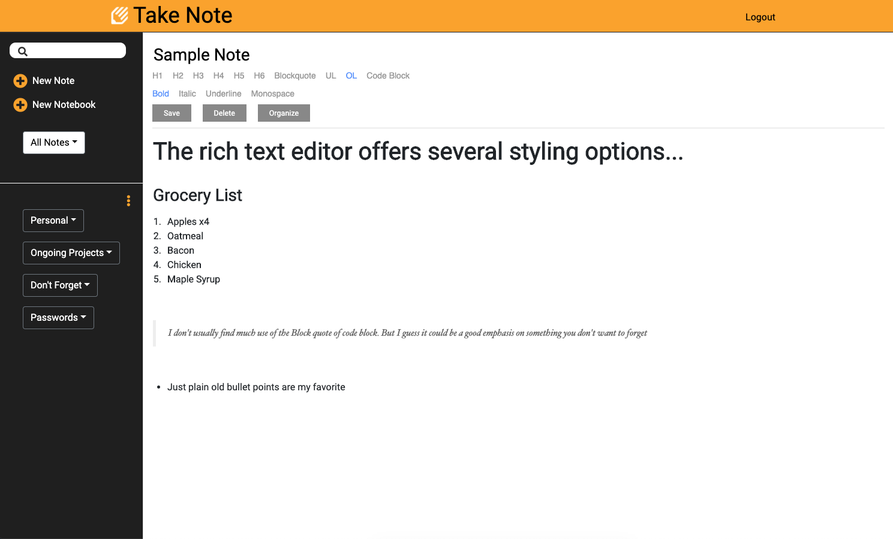

# **MERN Stack Notes Application**

My first MERN stack application. Took much influence from evernote. Users can create notes, save them and organize notebooks. I used Draft.js as my rich text editor component

## Screenshots

## Todo

- Add Notes to notebooks
- Move notes between notebooks
- Styling on homepage & Dashboard

## Quick Start

### **Install server dependencies**

`npm install`

#### **Install client dependencies**

`cd client`

`npm install`

`cd ../`

#### **Run**

`npm run dev`
